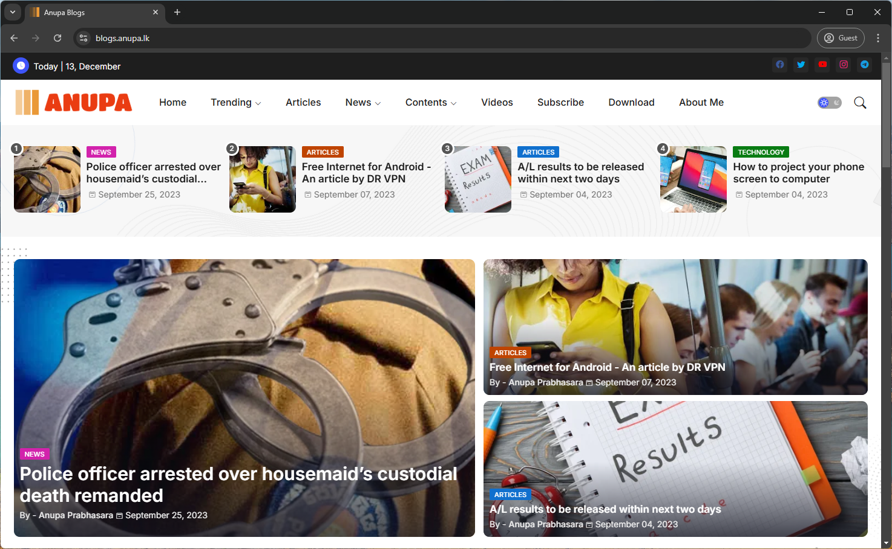
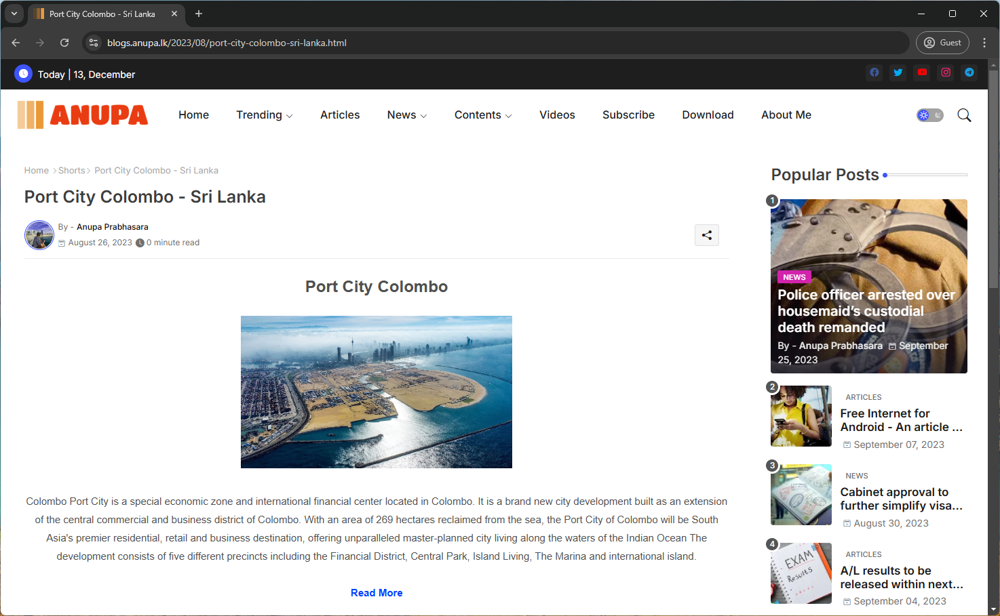
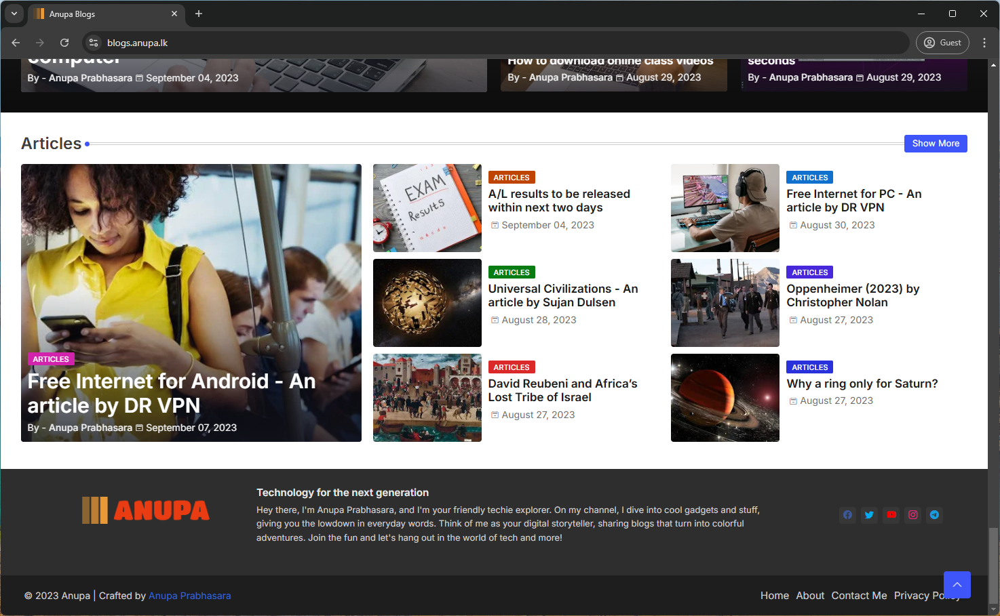

# Blogger Theme for News and Blogging Website

## Overview

This is a Blogger theme designed for a News and Blogging website. It incorporates modern web design principles with a responsive layout, custom styling, and essential functionalities for a blogging platform.

## Technologies Used

- **Frontend**:
  - **HTML5**
  - **CSS3**
  - **JavaScript** (for interactivity and dynamic elements)

- **XML**:
  - Used for Blogger platform configurations and integration.

## Features

### Home Page


- Clean and modern design with sections for featured articles, categories, and recent posts.
- Customizable widgets for social media links, recent comments, and newsletter subscriptions.

### Post Pages


- Responsive layouts for single posts with comment sections and social sharing options.
- Ability to add images, videos, and embed media in posts.

### Sidebar and Footer


- Customizable sidebar widgets for categories, archives, tags, and related posts.
- Well-designed footer with copyright, social media links, and sitemap links.

### Dynamic Content

- Real-time updates using JavaScript for recent posts, comment count, and categories.
- Lightweight, fast-loading pages optimized for SEO and performance.

### SEO Optimizations

- Clean, semantic HTML structure with meta tags, schema markup, and responsive design.
- Integration of XML sitemaps and Google Analytics tracking.

## Design Features

- **Responsive Design**:
  - Adapts seamlessly to various screen sizes using CSS media queries.
  
- **Accessibility**:
  - Color contrast, font sizes, and navigational elements optimized for accessibility.

- **Custom Styles**:
  - Customizable theme settings for colors, fonts, and layouts via Blogger’s custom CSS editor.

## XML Integration

- Configurations for Blogger platform, including categories, post templates, and custom tags.
- Schema for author and article details in XML format for search engines.

### Sample XML Code Structure

```xml
<?xml version="1.0" encoding="UTF-8" ?>
<!DOCTYPE html>
<html>
 <b:with value='data:view.isSearch'>
  <head>
<!-- Site Info -->
<meta content='width=device-width, initial-scale=1' name='viewport'/>
<title><data:view.title.escaped/></title>
<meta expr:content='&quot;text/html; charset=&quot; + data:blog.encoding' http-equiv='Content-Type'/>
<meta content='blogger' name='generator'/>
<link expr:href='data:blog.blogspotFaviconUrl' rel='icon' type='image/x-icon'/>
<link expr:href='data:blog.blogspotFaviconUrl' rel='icon' sizes='32x32'/>
<link expr:href='data:blog.blogspotFaviconUrl' rel='icon' sizes='100x100'/>
<link expr:href='data:blog.blogspotFaviconUrl' rel='apple-touch-icon'/>
<meta expr:content='data:blog.blogspotFaviconUrl' name='msapplication-TileImage'/>
<link expr:href='data:blog.url' hreflang='x-default' rel='alternate'/>
<meta expr:content='data:skin.vars.keycolor' name='theme-color'/>
<meta expr:content='data:skin.vars.keycolor' name='msapplication-navbutton-color'/>
```

## Getting Started

1. **Download the Theme**:
   - Clone or download the theme files from the repository.

2. **Upload to Blogger**:
   - Navigate to Blogger, go to **Themes** and click **Backup/Restore**.
   - Upload the theme XML file.

3. **Customizations**:
   - Use Blogger’s Theme Designer to make custom changes to colors, fonts, and layouts.

4. **Testing**:
   - Preview the theme, ensuring responsiveness and proper functionality across devices.

## License

This Blogger theme is licensed under the MIT License.

---

**Happy Blogging! ✍️**
